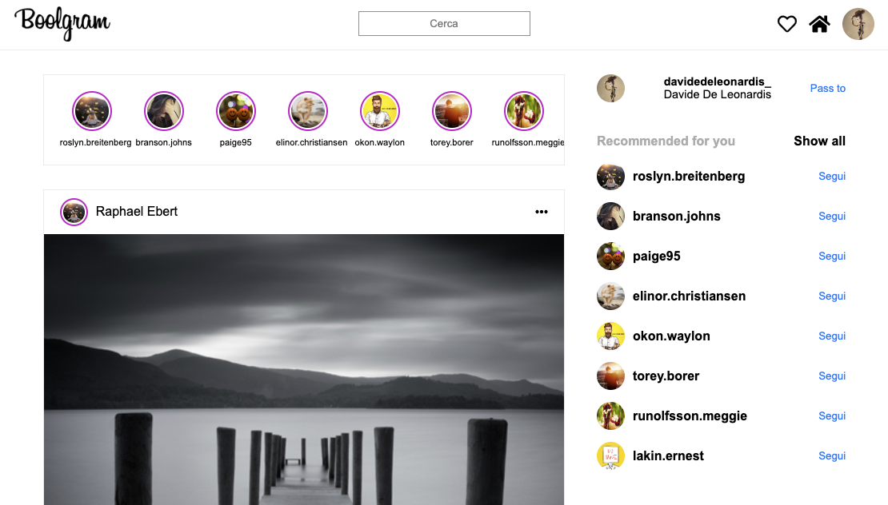

# Vue-boolgram

## Instagram web's home page made with Vue CLI; possibility of liking posts, adding comments, show all comments
### <a href="https://vue-boolgram.web.app" target="_blank">- SITE PREVIEW -</a><br><br>

## Project setup
```
npm install
```

### Compiles and hot-reloads for development
```
npm run serve
```

### Screens
