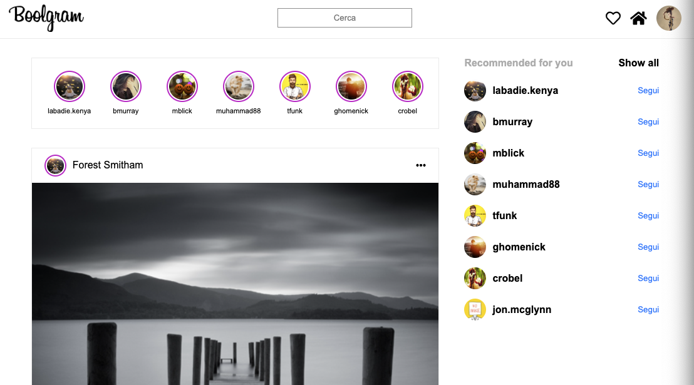

# Vue-boolgram

## Instagram web home page made with Vue CLI; possibility of liking posts, adding comments, show all comments
Soon:
- Opening stories
- Skeleton loading
- Loading only some posts, when arriving at the end of the page loading others

<br>

## Project setup
```
npm install
```

### Compiles and hot-reloads for development
```
npm run serve
```

### Screens
